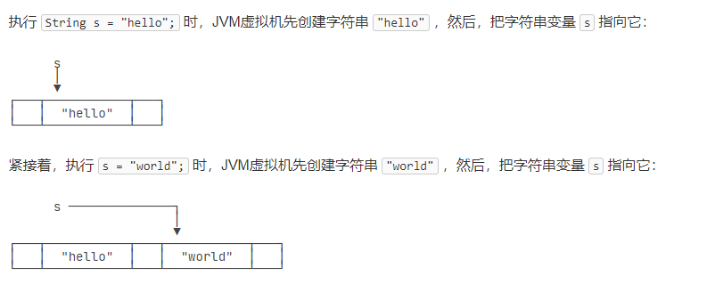

因为有一些编程经验，所以基础数据类型就不写了，主要总结一下JAVA和C++内存的一些区别。

首先JAVA是在JVM上运行的，所以其动态内存是JVM管理，而C++是在虚拟地址上进行手动管理。

JAVA不存在const关键词，使用的是final声明常量
const -> final
auto -> var

char类型是UNicode编码

## 引用类型
引用类型有：类（如String）、接口（类比为C++的纯虚类）、数组等。

### String
String可以用"""..."""表示多行字符串，belike python中的写法

字符串不可变性：
执行以下语句会发生图中的事情
```java
String s = "hello";
s = "world";
```
