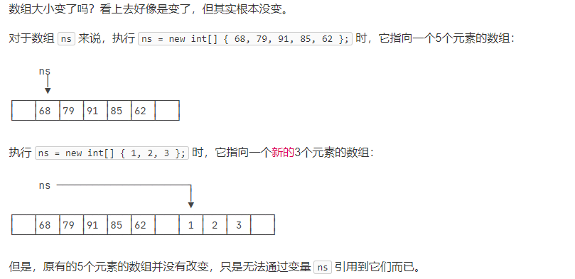
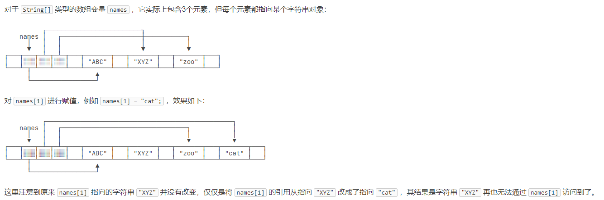

因为有一些编程经验，所以基础数据类型就不写了，主要总结一下JAVA和C++内存的一些区别。

首先JAVA是在JVM上运行的，所以其动态内存是JVM管理，而C++是在虚拟地址上进行手动管理。

JAVA不存在const关键词，使用的是final声明常量
const -> final
auto -> var

char类型是UNicode编码

## 引用类型
引用类型有：类（如String）、接口（类比为C++的纯虚类）、数组等。

### String
String可以用"""..."""表示多行字符串，belike python中的写法

字符串不可变性：
执行以下语句会发生图中的事情，重新指向新内存而不是修改当前内存
```java
        String s = "hello";
        s = "world";
```


### 数组
#### 基本类型元素
元素直接存储在数组中，当修改元素的时候，直接修改数组中的元素内容。当重新new数组的时候，不修改原内存中数据，而是重新new一块。
```java
        ns = new int[] { 68, 79, 91, 85, 62 };
        System.out.println(ns.length); // 5
        ns = new int[] { 1, 2, 3 };
```

#### 引用类型元素
元素为引用类型，则相当于将其指针存储在数组中，指针指向内存中的元素，当修改元素的时候，先重新新生成数据，再将指针指向新的内存地址。当重新new数组的时候，和所有引用类型一样，不修改原内存中数据，而是重新new一块。


## 输入输出
输出用`System.out.print*()`即可

输入要先`Scanner scanner = new Scanner(System.in)`，再`scanner.nextLine()`之类的